# Perfekti polimondi ar ekstrēmām īpašībām


```python
# n = 8, 12, 16, 20, 24; max diametrs
['ABDEDEAB', 'ABDEDEFBACBC', 'ABABDEDEDEDEABAB', 'ABABDEDEDEDEABFBACBC', 'ABABABDEDEDEDEDEDEABABAB']
```
    
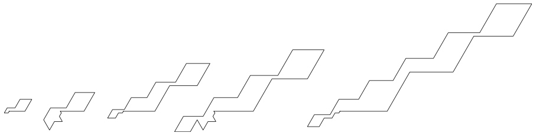
    

```python
# n = 9, 13, 17, 21; max diametrs
['ABFDEDCDC', 'ACDCDFAFAFEDF', 'ACDCDCEFAFAFAFAEF', 'ABABDEDEDEDEABFBACBC']
```

    
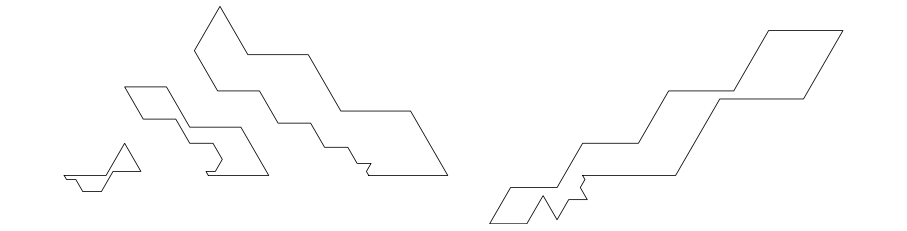


```python
# n = 10, 14, 18, 22; max diametrs
['ABFDEDCDBF', 'ACDCDEFAFAFABC', 'ABABDEDEDECDFAFABC', 'ABDEDEDEDFBABABABABACB']
```


    
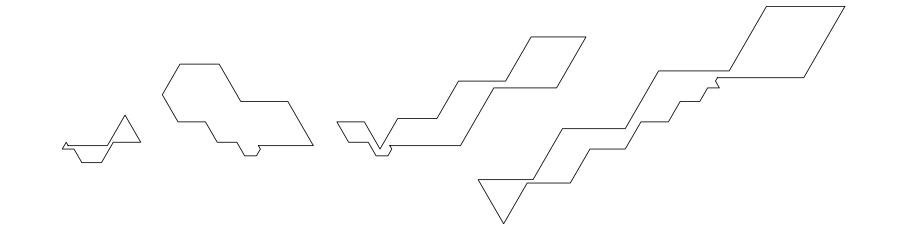
    


```python
# n = 11, 15, 19, 23; max diametrs
['ACDCEAFEFAB', 'ABAEDEDEDBACBCB', 'ABABAEDEDEDECECDCAC', 'ABABAEDEDEDECDEDBABABAC']
```
    
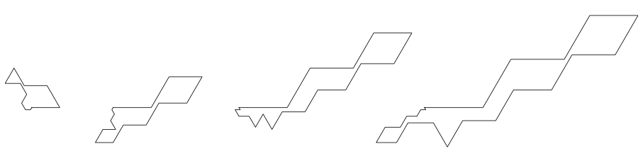
    


```python
# 8, 12, 16, 20; min diametrs
['ACECEFAC', 'ABDFDBDEAEDF', 'ABDCEAFDBDEAEFDE', 'ACACECEAECEAFDBDFEAE', 'ABCDEABFDFDBDFDBDFEFAFDE']
```

    
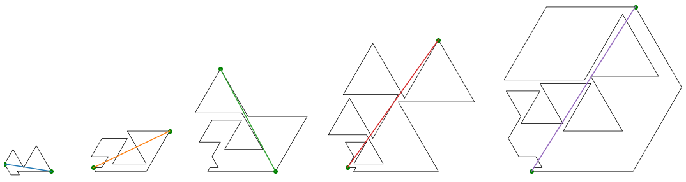
    


```python
# 9, 13, 17, 21; min diametrs
['ACECEAEAC', 'ACDEFBDBAFDFE', 'ABDFDBCEAECEAEFDE', 'ABDFDCACACEDFDFEFAFEF']
```
    
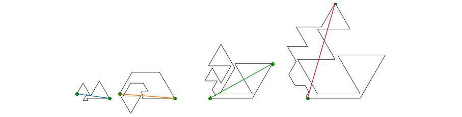
    


```python
# 10, 14, 18, 22-polimondi - min diametrs
['ACBDFEDFEF', 'ACEDFABDFDCACB', 'ABDBDFDFBFEDBDFDFE', 'ABCDEABFDFDCDFAECEFAEF']
```

    
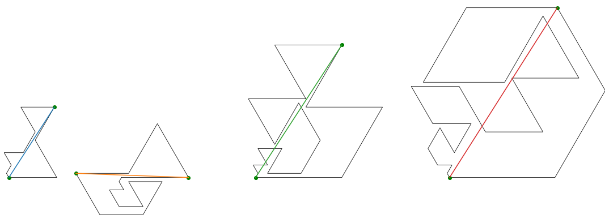
    


```python
# 11, 15, 19, 23-polimondi - min diametrs
['ACDEACAEFDF', 'ABDFDBCDFEAEFDF', 'ABDBDFDFBFDFDBDFDFE', 'ABCDEACAEAECEAECDEAEDFE']
```

    
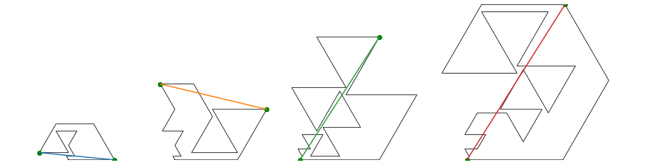
    


```python
# 8, 12, 16, 20, 24-polimondi ar minimālu platumu
['ABDECEFE', 'ABDFDBDEAEDF', 'ABABDEDEDEDEABAB', 'ABABACEDEDEDEDEDFABC', 'ABABABFDEDEDEDEDEDBCDBDC']
```
    
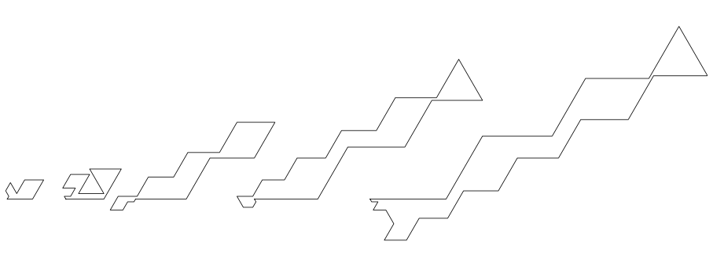
    


```python
# 9, 13, 17, 21-polimondi ar minimālu platumu
['ABFDEDCDC', 'ABDECDEAFBAEF', 'ABDECDEACAFEABFDF', 'ABABACEDEDEDEDEFACDBC']
```

    
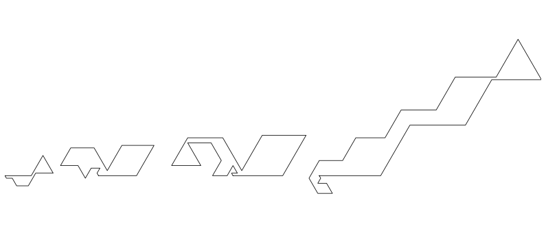
    


```python
# 10, 14, 18, 22-polimondi ar minimālu platumu
['ABFDEDCDBF', 'ABACEDEDEDFBAB', 'ABDFDBDECDFAFABFDF', 'ABABABDEDEDEDEFDCDFDEF']
```

    
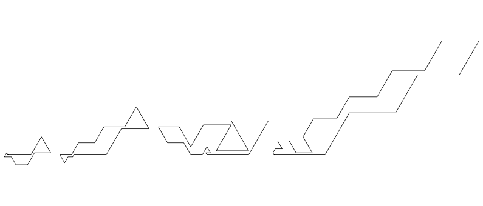
    


```python
# 11, 15, 19, 23-polimondi ar minimālu platumu
['ABDECDFAEAE', 'ABABDEDEDFDCEFE', 'ABABAEDEDEDECECDBDB', 'ABABACEDEDEDEDEFABDCACB']
```

    
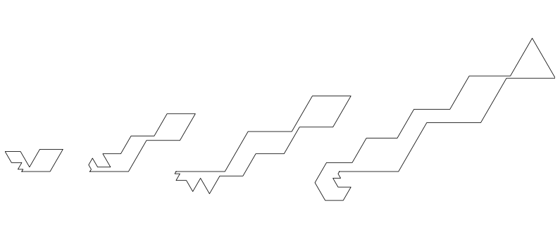
    


```python
# 8, 12, 16, 20, 24-polimondi ar maksimālu platumu
['ACDEAEAC', 'ACBDEDFEAFAB', 'ACBCEDEDFAFAFEAB', 'ABCDCDEFEFEAFABCACAB', 'ABCBDCDEDEFEAFAFEFABABDB']
```

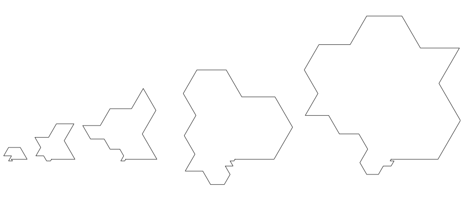
    


```python
# 9, 13, 17, 21-polimondi ar maksimālu platumu
['ACEDEABAC', 'ABCDCEFEFEFAB', 'ACBCDEDEFAEAFAFAB', 'ABCBDCDEDFEFAFEFAFAFB']
```


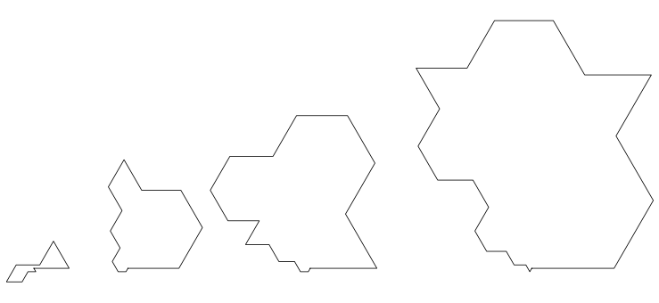
    


```python
# 10, 14, 18, 22-polimondi ar maksimālu platumu
['ABCDEFDFEF', 'ABCDCEFEFEFBAC', 'ABFEFEDCDCBDCABABC', 'ACBCBDEDEDEFAFAFAFAEAF']
```
    
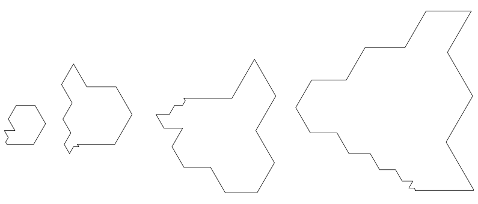
    


```python
# 11, 15, 19, 23-polimondi ar maksimālu platumu
['ABCDEFDEFAB', 'ACBCEDEFDFAFAFB', 'ABCDCDEFEFEFABABACB', 'ABCBDCDEDEFAEFEAFAFABAB']
```

    
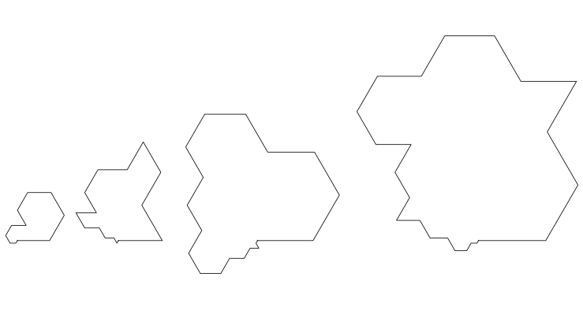
    


```python
# 8, 12, 16, 20, 24-polimondi ar minimālu laukumu
['ACECEFBF', 'ABDFDBDFDFDF', 'ACBDFDFBFEDCEFBF', 'ABAECEFECACDECDECBAC', 'ABAFDBDEFECACDECDFDBDCAB']
```

    
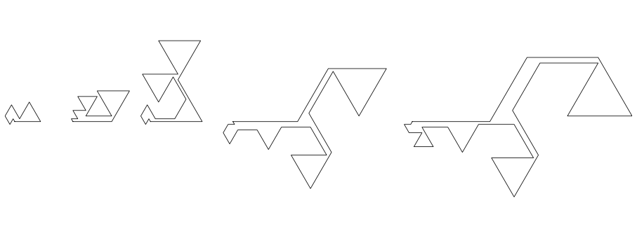
    


```python
# 9, 13, 17, 21-polimondi ar minimālu laukumu
['ACECEAEAC', 'ACEDEACAEABCB', 'ABDFDBCEAECEAEFDE', 'ABDFDCDFBFEFACECBDBAC']
```

    
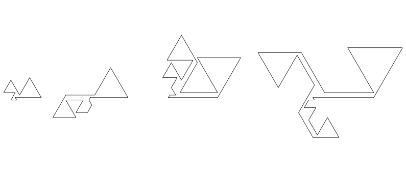
    


```python
# 10, 14, 18, 22-polimondi ar minimālu laukumu
['ABFDEDCDBF', 'ABFDFDBDECDCAF', 'ABCEAECDFBFEDCDFEF', 'ABAECEFECACDECDFDBCABF']
```

    
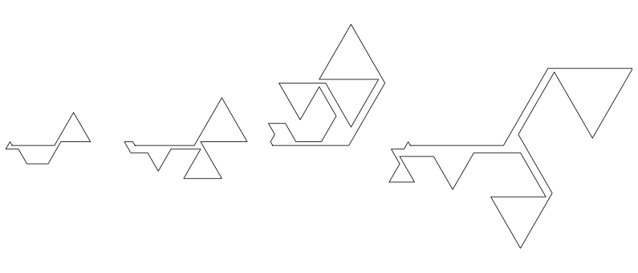
    


```python
# 11, 15, 19, 23-polimondi ar minimālu laukumu
['ABDFDBDFEDE', 'ABDFDCDFBFEFBDB', 'ABDFDCDFBFEDFBABDBF', 'ABDFDBCDFBFDEACAFEDFEDF']
```
    
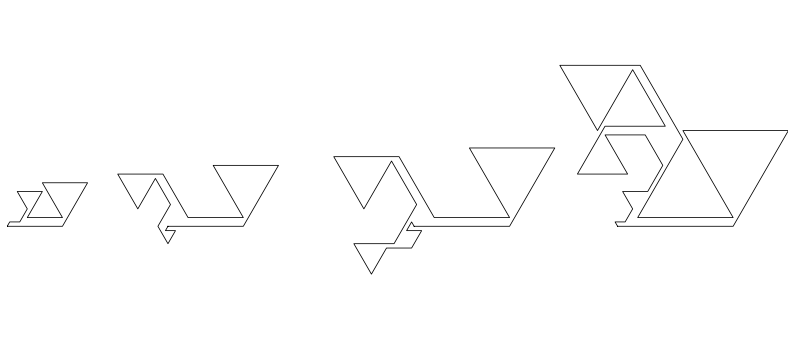
    


```python
# 8, 12, 16, 20, 24-polimondi ar maksimālu laukumu
['ACDEAEAC', 'ABCDEDEFAFAB', 'ABCDCDEFEAFAFEAF', 'ABCBCDEDEFEFEFABAFAE', 'ABCBCDEDEDEFEAFAFABFABAB']
```


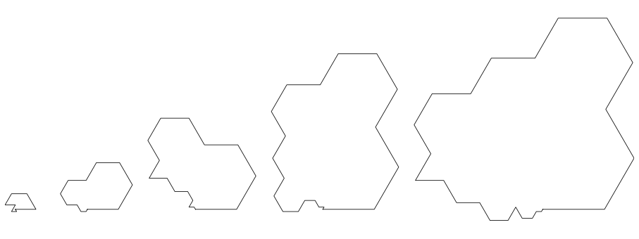
    


```python
# 9, 13, 17, 21-polimondi ar maksimālu laukumu
['ACEDEABAC', 'ABCDEDEFAFACB', 'ABCDCDEFEFAFAFBDC', 'ABABCDCDEDEFEFEFAEFAB']
```

    
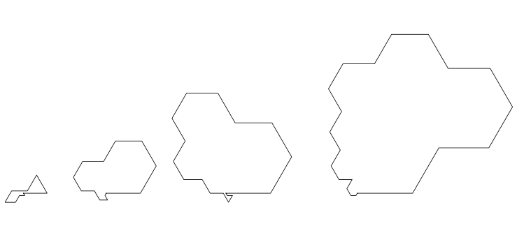
    


```python
# 10, 14, 18, 22-polimondi ar maksimālu laukumu
['ABCDEFDFEF', 'ABCDEDEAEFABAB', 'ABCDCDEFEFEABAFABF', 'ABCBDCDEDEFEFAFAFAFBFB']
```

    
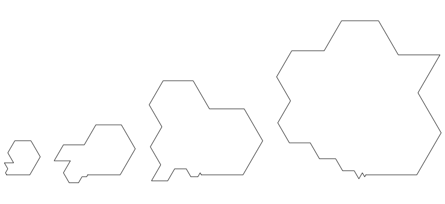
    


```python
# 11, 15, 19, 23-polimondi ar maksimālu laukumu
['ABCDEFDEFAB', 'ABCBDEDEFEAEFAF', 'ABCBCDEDEFEFAEFAFAE', 'ABCBCDCEDEFEFEFAFAFAFAC']
```

    
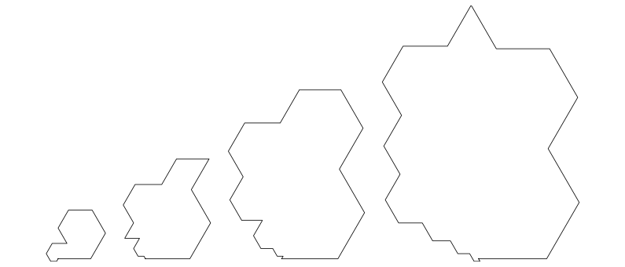
    

