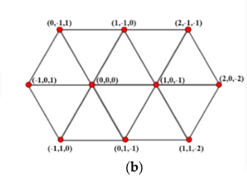
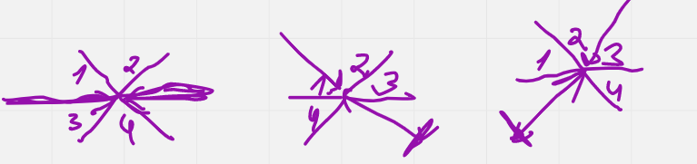
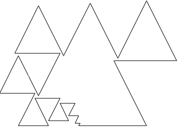
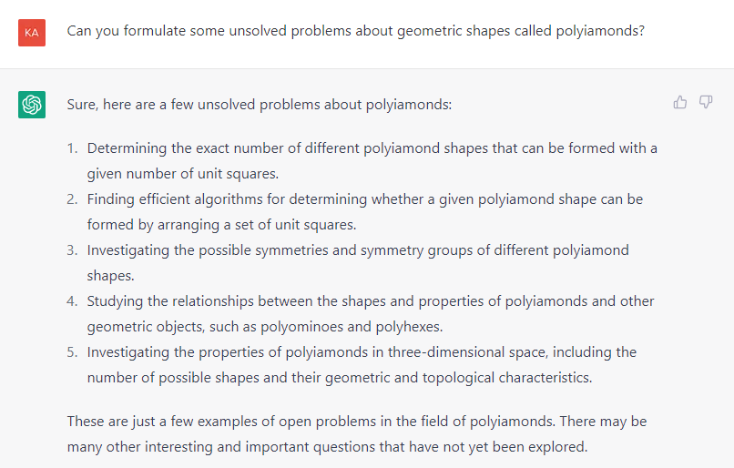

# Par polimondiem

## Trijstūra režģa koordinātes

Apzīmēsim sešas debesspuses kā sekojošus plaknes vektorus: 

$$A = (1,0),\  B = (1/2, \sqrt{3}/2),\  C = (-1/2, \sqrt{3}/2),$$

$$D = (-1,0),\  E = (-1/2, -\sqrt{3}/2),\  F = (1/2, -\sqrt{3}/{2}).$$

Lai nebūtu jāstrādā ar daļskaitļiem un kvadrātsaknēm (un lai koordinātes 
neatšķirtos pēc režģa mērvienībām), ieviešam trijstūra režģa koordinātes 
kā trīs skaitļu komplektu sekojoši: 

$$A = (1,0,-1),\; B = (1,-1,0),\; C = (0,-1,1),\; D = (-1,0,1),\; E = (-1,1,0),\; F = (0,1,-1).$$

Šos vektorus var saskaitīt un pārvietoties pa trijstūra režģa punktiem - 
katram punktam šajā trijstūru režģī atbilst veselu skaitļu trijnieks $(x,y,z)$. 
Tā kā koordinātes joprojām apraksta plaknes punktus, tad šie trijnieki 
apmierina vienu un to pašu lineāro sakarību: $x+y+z = 0$.
(Katru punktu ar trim veselām koordinātēm, kam $x+y+z = 0$ var iezīmēt 
šajā trijstūru režģī).

## Polimondu konstruēšana kanoniskā secībā

Lai būtu vieglāk salīdzināt divu polimondu pārlases algoritmu uzvedību, 
tos pārstaigājam vienmēr vienādā veidā: 

Ir spēkā trīs gadījumi (sk. zīmējumu): 

* Ja iepriekšējais gājiens bijis virzienā A vai D, tad nākamais var būt 
  virzienos C, B, E, F (šādā secībā). 
* Ja iepriekšējais gājiens bijis virzienā C vai F, tad nākamais var būt 
  virzienos virzienos D, B, A, E (šādā secībā). 
* Ja iepriekšējais gājiens bijis virzienā B vai E, tad nākamais var būt 
  virzienos virzienos D, C, A, F (šādā secībā).

Perfektus polimondus konstruē, vispirms veicot gājienu virzienā A par $N$ garuma vienībām, 
kur $N$ ir iepriekš uzdotais polimonda malu skaits.
Pēc tam veic otro gājienu (obligāti virzienos C vai B -- lai pirmais pagrieziens būtu 
pa kreisi). Ja pirmais pagrieziens būtu pa labi, tad aplūkojam polimonda 
spoguļattēlu (un ja pirmais gājiens nav virzienā A, tad polimondu pagriež tā, lai 
pirmais gājiens vienmēr būtu pa labi). 

**Definīcija:** Par $n$-*polimondu* sauc vienkāršu slēgtu lauztu līniju (jeb daudzstūri) no $n$ posmiem, 
kam visas virsotnes atrodas trijstūru režģa virsotnēs, bet malas iet pa trijstūru režģa līnijām. 

**Definīcija:** $n$-polimondu sauc par *perfektu*, ja tā malu garumi, sākot skaitīt no kādas virsotnes, 
ir skaitļi $n,n-1,n-2,\ldots,3,2,1$ tieši šādā secībā.

**Definīcija:** $n$-polimonda *kodējums ar debesspusēm* ir virknīte garumā $n$, kura 
sastāv no 6 burtiem (`A`,`B`,`C`,`D`,`E`,`F`), kas norāda uz malu virzieniem, kuros tiek vilktas secīgas
polimonda malas. (Perfektiem polimondiem malu garumi ir secībā  $n,n-1,n-2,\ldots,3,2,1$, 
bet citiem polimondiem kopā ar debespusi kodējumā norāda arī attiecīgās malas garumu.)

**Definīcija:** Polimondu virkni garumā $k$, kas satur polimondus ar 
$n, n+2, \ldots, n+2(k-1)$ malām sauc par *perfektu polimondu virkni
ar indukcijas soli 2*, ja 
katriem diviem blakusesošiem polimondiem (ar $n+2i$ un $n+2i+2$ malām, $i = 0,\ldots,k-2$) 
to debesspušu kodējumi sakrīt, izņemot to, ka polimonda ar $n+2i+2$ malām 
kodējumā ir iesprausti divi jauni debesspušu burti (jebkurās divās vietās).  
Līdzīgi definē arī perfektu polimondu virknes ar indukcijas soli $4, 6, 8$ utml. 

(Vai polimondu virknē malu iespraušanai jānotiek pēc kādas regulāras shēmas, piemēram, 
debesspušu kodējumiem jābūt ģenerējamiem ar *bezkonteksta gramatiku* vai ar 
vienkāršāku metodi - periodisku apakšvirkņu ievietošanu divās kodējuma vietās, vēl neesam izlēmuši.)

**Definīcija:** Par polimonda laukumu sauc veselu skaitli - tajā ietilpstošo mazo trijstūrīšu skaitu. 

**Definīcija:** Par polimonda gabarītizmēriem sauc naturālu skaitļu trijnieku $(i,j,k)$, kur 
* $i$ izsaka mazāko attālumu starp divām horizontālām taisnēm trijstūra režģī tādām, 
  ka visas polimonda virsotnes atrodas starp šīm taisnēm (vai uz tām). 
* $j$ izsaka mazāko attālumu starp divām paralēlām slīpām taisnēm (kas vilktas no ziemeļaustrumiem uz dienvidrietumiem) tādām, 
  ka visas polimonda virsotnes atrodas starp šīm taisnēm (vai uz tām). 
* $k$ izsaka mazāko attālumu starp divām paralēlām slīpām taisnēm (kas vilktas no ziemeļrietumiem uz dienvidaustrumiem) tādām, 
  ka visas polimonda virsotnes atrodas starp šīm taisnēm (vai uz tām). 

**Definīcija:** Par $2n+1$ polimonda *relatīvo kodējumu* sauc $2n$-burtu virknīti, kas
sastāv no 4 burtiem (`a`,`b`,`c`,`d`). Pirmo malu novelk jebkurā izvēlētā virzienā (parasti - taisni pa labi), 
šai malai kodējumā neviens burts neatbilst. Turpmākos burtus iegūst sekojoši:

* burtu "a" raksta kodējumā tad, ja nākamā mala pret iepriekšējo veic asu/šaurleņķa pagriezienu pa kreisi ($60^{\circ}$ leņķis); 
* burtu "b" raksta kodējumā tad, ja nākamā mala pret iepriekšējo veic platleņķa pagriezienu pa kreisi ($120^{\circ}$ leņķis); 
* burtu "c" raksta kodējumā tad, ja nākamā mala pret iepriekšējo veic platleņķa pagriezienu pa labi ($120^{\circ}$ leņķis); 
* burtu "d" raksta kodējumā tad, ja nākamā mala pret iepriekšējo veic asu/šaurleņķa pagriezienu pa labi ($60^{\circ}$ grādu leņķis). 

Perfektiem polimondiem pieņemam, ka malu garumi ir secībā  $n,n-1,n-2,\ldots,3,2,1$, 
bet citiem polimondiem kopā ar relatīvo virzienu (a,b,c,d) norāda arī attiecīgās malas garumu.

**Definīcija:** Polimonds ir *divdaļīgs*, ja eksistē kāda diagonāle, kura pilnībā atrodas šī polimonda iekšpusē un 
visi augstumi, kurus novelk no polimonda virsotnēm uz šo diagonāli arī pilnībā atrodas polimonda iekšpusē. 
(Vienkāršoti sakot, polimondam ir koka lapas forma ar centrālo dzīslu, no kuras var novilkt perpendikulus uz jebkuru vietu uz 
lapas perimetra.)

## Atklāti jautājumi 

### Polimondu eksistence un skaits

1. Vai katram nepāra skaitlim $n$ eksistē perfekts $n$-polimonds?  
   **Atbilde:** Gandrīz noteikti atbilde ir "Jā". Induktīvās konstrukcijas $4n+1 \rightarrow (4n+1) + 4$ un 
   $4n+3 \rightarrow (4n+3)+4$ ir atrodamas direktorijā "konstrukcijas", bet pagaidām vēl nav vienkāršu pierādījumu,
   ka šīs lauztās līnijas sevi nekrusto.
2. Vai katrai naturālu skaitļu $1,2,\ldots,2n+1$  permutācijai 
   eksistē maģisks polimonds, kurā malu garumu secība atbilst šai permutācijai, bet malu virzienus var izvēlēties jebkādi? 
3. Aplūkojam kādu no $(2n)!$ permutācijām, kurās var izkārtot
   $2n+1$-stūra malu garumus (variantus, kas atšķiras tikai ar ciklisku permutāciju uzskatot par identiskiem). 
   Kurai no malu garumu permutācijām būs lielākais/mazākais skaits tai atbilstošo maģisko 
   polimondu? Vai perfektie polimondi ir biežāk (vai arī retāk?) sastopami nekā maģiski polimondi ar citām malu garumu permutācijām?
4. Ar $M_{2n+1}$ apzīmējam visu perfekto $2n+1$-polimondu skaitu.  
   Piemēram, $M_{5} = 1$, 
   $M_{7} = 2$, $M_{9} = 3$, $M_{11} = 21$ utt.  
   Ar $L_{n}$ apzīmējam to
   slēgto lauzto līniju skaitu, kur malu garumi arī atbilst permutācijai 
   $1,2,\ldots,n$, kura katrā virsotnē maina virzienu,  bet šī līnija drīkst sevi krustot, vilkt pa to pašu līniju 
   vairākas reizes vai sakrist virsotnes.  
   Vai eksistē galīga robeža:
   ${\displaystyle \lim_{n \rightarrow \infty} \frac{M_{2n+1}}{L_{2n+1}}?}$  
   Vai šī robeža atškiras no robežas:
   ${\displaystyle \lim_{n \rightarrow \infty} \frac{M_{2n}}{L_{2n}}?}$  
   (Citiem vārdiem - vai perfektie polimondi ar nepāra malu skaitu ir "retāk sastopami" nekā perfektie polimondi ar pāra malu skaitu?).  
   **Hipotēze:** Abas robežas, visticamāk, ir $0$ - sevis krustošana ir ļoti biežs iemesls polimonda "izbrāķēšanai" algoritmos arī maziem $n$. 
   No otras puses, atļaujot gan pāra, gan nepāra malu skaitu, virkne $M_5, M_6, M_7, M_8\ldots$ varētu nebūt monotoni augoša, bet virkne 
   $L_5, L_6, L_7, L_8\ldots$, visticamāk, ir augoša.
5. Vai virkne $M_{2n+1}$ (perfekto $2n+1$-polimondu skaits) aug, ja $n$ aug?
6. Vai kādai no perfekto/maģisko polimondu pasaulē esošajām skaitļu virknēm varam atrast "ģenerējošo funkciju" 
   (pakāpju rindas summu, kuras koeficienti 
   ir attiecīgās virknes locekļi)? Sk. [Generating functions](https://cse.iitkgp.ac.in/~animeshm/generating_funct.pdf).
7. Atrast ģenerējošo funkciju virknei $L_n$ (visām slēgtajām lauztajām līnijām ar posmu garumiem 
   $n,n-1,\ldots,1$ ieskaitot tās, kuras sevi krusto).  
   **Iesildīšanās uzdevums:** Aplūkojam skaitļu virkni $1,2,3,\ldots,n$. Saskaitām visus veidus, kā šajā virknē var
   salikt "+" un "-" zīmes tā, lai rezultāts būtu $0$. Visticamāk, šim jautājumam ir kombinatorikā zināma atbilde. 
   Uzdevums atrast formulu $L_n$ (cik trijstūru režģī ir lauztu līniju, kuras atgriežas sākumpunktā, ja līniju garumi ir 
   $1,2,3,\ldots,n$) ir sava veida vispārinājums, bet vēl joprojām pietiekami "algebrisks", lai to būtu ērti saskaitīt. 
   Iegūstot novērtējumu virknei $L_n$ (un zinot, ka maģisko polimondu nevar būt vairāk kā $L_n$), būsim ieguvuši 
   novērtējumu virknei $M_n$ no augšas.  
   **Atbilde:** Abos gadījumos (gan viendimensiju uzdevumam, gan arī "perfekto lauzto līniju" uzdevumam trijstūru režģī)
   eksistē dinamiskās programmēšanas algoritms, kas ļauj tos saskaitīt polinomiālā laikā.
8. Pierādīt vai apgāzt sekojošu apgalvojumu: Slēgtā lauztā līnijā ar posmu garumiem $1,2,\ldots,n$, 
   kas iet pa trijstūru režģa līnijām, posmu vektorus var saskaitīt citā secībā (nemainot posmu garumus un virzienus) tā, 
   lai iegūtu maģisku polimondu tad un tikai tad, ja šajā lauztajā līnijā nevienā no trim virzieniem 
   nav novilkts vairāk par pusi no visiem posmiem. 
   (Ja divi vektori ir paralēli, bet pretēji vērsti, uzskatām, ka to virzieni sakrīt. 
   Piemēram, austrumu virziens (A) un rietumu virziens (D) ir vienādi. 
   Tāpat arī ziemeļaustrumu (B) vai dienvidrietumu (E) virzieni, 
   vai ziemeļrietumu (C) un dienvidaustrumu (F) virzieni.). 

### Polimondu induktīva ģenerēšana

1. Kuriem naturāliem $C$ eksistē bezgalīga perfektu $n$ polimondu virkne, kuru debesspušu kodējumā 
   var uzģenerēt ar bezkonteksta gramatiku (*context-free grammar*), kuras produkcijās katrā solī 
   pievieno ne vairāk kā $C$ jaunus simbolus?  
   **Atbilde:** Līdz šim zināmās konstrukcijas, kur pefektam polimondam var induktīvi pieaudzēt $C=4$ vai $C=8$
   jaunas malas, nav aprakstāmas ar bezkonteksta gramatikām (var pierādīt ar "pumpēšanas lemmu"). 
   Tās ir "kontekstjūtīgas gramatikas", jo jaunus burtus iesprauž uzreiz četrās vietās.
   Atbilde pie $C=2$ nav zināma; nav zināma arī bezkonteksta gramatika, kura vienā solī pieaudzē vairāk nekā divas malas.
2. Vai eksistē konstante $C$ un bezgalīgi daudzi perfekti polimondi, kuriem debesspušu kodējums 
   veido periodisku virkni, kura vismaz divreiz atkārtojas (un vēl ne vairāk kā $C$ simboli pirms vai pēc šiem periodiem)? 
3. Vai eksistē bezgalīga pefektu polimondu virkne, kurā malu skaits aug kā ģeometriskā progresijā, 
   bet malu virzienus (A,B,C,D,E,F) 
   var ģenerēt ar [Lindenmaiera sistēmu](https://en.wikipedia.org/wiki/L-system). 
   Piemēram, vai varētu būt šaurleņķu polimondi ar malu skaitu $n = 9, 27, 81, \ldots$, kur katra 
   nākamā polimonda virzienu virknīti var iegūt, pēc kaut kādiem likumiem pārrakstot jeb aizvietojot 
   iepriekšējā polimonda virzienu virknīti?
4. Perfektu $2n+1$-polimondu $P_1$ un perfektu $2n+3$-polimondu $P_2$ saucam par *dvīņu polimondiem*, ja 
   $P_2$ debespušu kodējumu var iegūt, iespraužot $P_1$ debespušu kodējumā divus jaunus virzienu burtus. 
   Vai eksistē bezgalīgi daudzi dvīņu polimondu pāri? Vai eksistē cik patīk garas virknes, kurās 
   katri divi blakusesoši locekļi ir dvīņu polimondi? 

### Polimondu laukumi 

1. Kādas vērtības var (vai noteikti nevar) pieņemt maģiska $2n+1$-polimonda laukums?
2. Kādas vērtības var (vai noteikti nevar) pieņemt perfekta $2n+1$-polimonda laukums?
3. Cik pavisam ir perfektu (maģisku?) polimondu ar doto laukumu? 
4. Kāds ir lielākais un mazākais laukums perfekta $2n+1$ polimonda izliektajai čaulai (mazākajam izliektajam daudzstūrim, kurš 
   satur šo polimondu - tā malas var neiet pa trijstūru režģa līnijām)? 
5. Kāds var būt lielākais un mazākais malas garums regulāram minimālajam sešstūrim, kurš pilnībā satur savā iekšpusē 
   perfektu $2n+1$ polimondu?
6. Vai eksistē sakarība, kas ļauj pēc perfekta polimonda iekšējo leņķu skaita (cik tur ir 60, 120, 240 vai 300 grādu leņķi) 
   noteikt, kādas vērtības var pieņemt polimonda laukums?
7. Vai eksistē sakarība, kas ļauj atrast polimonda laukumu, ja zināms režģa punktu skaits 
   uz maģiska polimonda perimetra (parametrs $b$) un  
   trijstūru režģa punktu skaits šī polimonda iekšpusē (parametrs $i$). 
   Sal.  [Pīka formula](https://en.wikipedia.org/wiki/Pick%27s_theorem).
8. Definējam sekojošu "rijīgu" algoritmu maģiska polimonda laukuma palielināšanai - izsakām esoša
   maģiska polimonda malas ar vektoriem, kuri summā dod 0. Ja kādus divus vektorus šajā summā var samainīt tā, 
   ka polimonda laukums palielinās, tad samainām šos vektorus. Atkārtojam šo darbību, līdzkamēr 
   nekādu divu malu vektoru samainīšana laukumu nepalielina. Vai šādā "rijīgā" veidā noteikti atradīsim 
   polimondu ar maksimālo laukumu, kuru var izveidot no malu vektoriem? (Vai arī ir risks atrast "lokālu maksimumu"?)
 

### Dažādi ģeometriski raksturlielumi

1. Kādos punktos var atrasties maģiska (pefekta?) $2n+1$-polimonda baricentrs (smaguma centrs)? 
   Kāda ir visu iespējamo baricentru ģeometriskā vieta, ja tos paralēli pārnes tā paša mazā trijstūrīša iekšpusē? 
   (Smaguma centru definē kā visu polimondā ietilpstošo mazo trijstūrīšu centru koordinātu aritmētisko vidējo.)
2. Kādu vislielāko un vismazāko vērtību var pieņemt perfekta $2n+1$-polimonda gabarīts vienalga kādā no trim virzieniem?
   Kādas vērtības var pieņemt gabarītu trijnieks $(i,j,k)$ maģiskam (perfektam?) $2n+1$-polimondam. 
3. Kāds mazākais šauro leņķu (a60 un a300) skaits var būt perfekta $2n+1$-polimondam (par šauriem uzskatām arī 300 grādu 
   leņķus, kuros polimonds ir ieliekts).   
   **Hipotēze:** Pietiekami lielām $n$ vērtībām šauro leņķu skaits perfektā $2n+1$-polimondā ir skaitlis intervālā $[1;2n-1]$ 
   vai intervālā $[1; 2n+1]$ (šajā gadījumā visi leņķi būs šauri). 
4. Kurām $n$ vērtībām eksistē perfekti $(2n+1)$-polimondi, kuros ir tikai $60$ vai $300$ leņķi?
   Perfekts $9$-polimonds ar šo īpašību redzams zīmējumā.    
     
   **Atbilde:** Līdz šim atrastās vērtības ir $n=9$, $n=27$, $n=29$. Viens no perfektajiem polimondu ežiem pie $n=27$:  
   
5. Bezgalīgā trijstūru režģa trijstūrīšus izkrāso 2 krāsās (paritātes krāsojums -- trijstūrīši ar kopīgu
   malu allaž nokrāsoti pretējās krāsās). Atrast, cik dažādu 
   krāsu trijstūrīšu var atrasties perfekta (maģiska) polimonda iekšpusē. Kurām $n$ vērtībām atrodas 
   maģiski $n$-polimondi, kurus var sagriezt rombiņos, kurus veido divi mazie trijstūrīši 
   (t.i. melno un balto trijstūrīšu skaits ir līdzsvarā). 

### Citi jautājumi

1. Uzdevums - ar vienkāršu lauztu līniju (bez posmu krustošanās), 
   kuras posmu garumi ir jāizvēlas noteiktā secībā
   (piemēram, $1,2,\ldots,2n+1$) jānokļūst no trijstūru režģa punkta $A$ uz trijstūru režģa punktu $B$,
   pārvietojoties tikai pa režģa līnijām.  
   Vai eksistē efektīvs algoritms, kurš nosaka, vai to var izdarīt? Vai arī šāds uzdevums prasa pilno pārlasi vai 
   ir pierādāmi NP-pilns (NP-complete)?
   Līdzīgs jautājums arī par kvadrātiņu režģi (varētu būt algoritmiski vieglāks).  
2. Aplūkojam regulāru sešstūri ar malas garumu $55$ (to var uzskatīt par "riņķi" trijstūru režģa metrikā ar rādiusu $55$). 
   Šis sešstūris satur visus tos punktus, kam pietiktu ar $10$ gājieniem garumā $10,9,8,\ldots,1$, lai atgrieztos sešstūra centrā). 
   No visiem sešstūra iekšpusē un uz perimetra esošajiem punktiem atzīmējam tos, no kuriem tiešām var atgriezties centrā.
   Kādu daļu no visiem punktiem esam atzīmējuši? Kas notiek ar atzīmēto punktu proporciju, ja malu skaitu ($k = 10$) palielina?  
   Vispārīgā gadījumā -- ja mums dots naturāls $n$ un esam nonākuši kādā punktā, kuru pēc rūtiņu režģa attālumu formulas, kur
   punkta PointTg(x,y,z) attālums līdz PointTg(0,0,0) ir $\max(|x|,|y|,|z|)$, un šis attālums nepārsniedz $1+2+\ldots+n$, 
   kāda ir varbūtība, ka tiešām varēsim atgriezties koordinātu sākumpunktā ar vienkāršu lauztu līniju, kas ir perfekta
   polimonda "aste"?  
   Sk. [Sešstūri pie n=36](https://github.com/kapsitis/polimondi/blob/main/oo-backtracking/matplotlib_hexagon.png) -- 
   jo tumšākā krāsā nokrāsots kāds punkts, jo vairāk dažādu lauztu līniju ar posmu garumiem $8,7,\ldots,1$, kas noved 
   koordinātu sākumpunktā.
3. Ja polimonda malu vektorus sašķiro $6$ grupās (atkarībā no virziena) un katrā virzienā vektoru garumus saskaita, 
   kādas ir iespējamās iegūto sešu vektoru kombinācijas dotajam $n$? Vai to vidū ir tādas sešu vektoru kombinācijas, kurām 
   piemīt papildu simetrija? Viens piemērs ir šaurleņķu polimondi, kuriem ir tikai trīs dažādi vektori. 

## Līdzīgas problēmas

**LV.NO.2016.9.5:**
Doti $2016$ skaitļi: $1^2$; $2^2$; $3^2$; $\ldots$; $2015^2$; $2016^2$.
Vai starp šiem skaitļiem var salikt "+" un "−" zīmes tā,
lai iegūtās izteiksmes vērtība būtu $0$? 

*Ilustrācija tam, kā summu vienādu ar $0$ var iegūt ar induktīvu konstrukciju.*
Sk. [NO, 2016.g. uzdevumi, atrisinājumi](https://www.nms.lu.lv/fileadmin/user_upload/lu_portal/projekti/nms.lu.lv/Arhivs/Olimpiades/NOL/NOV_66_atr.pdf). 

## Problēmas kopš 08.2023

1. Dota kaut kāda malu garumu $[1;n]$ permutācija. Kāds ir lielākais skaits ar dažādiem maģiskiem polimondiem, kuri izmanto šo permutāciju un kuriem visiem ir maksimālais laukums?
2. Vai eksistē indeksu gramatika, ar kuru var izveidot bezgalīgu valodu ar vārdiem alfabētā $\{ A,B,C,D,E,F \}$ tā, ka jebkurš vārds šajā valodā ir perfekta polimonda kodējums ar virzienu burtiem?
3. Vai visas iespējamās induktīvās pārejas, kas saistītas ar $4,6,8$ jaunu virziena burtu iespraušanu, ir aprakstāmas ar kaut kādu kopīgu īpašību (piemēram, virzienu burti ir noteiktā skaitā vai attiecīgo vienības vektoru summa ir noteikta)?
4. Kāda daļa no perfektajiem polimondiem ir tādi, kuriem var pielietot kādu no jau zināmajām induktīvajām pārejām (piemēram, $k \rightarrow k+4$)? 
5. Vai eksistē induktīva pāreja no viena šaurleņķu perfekta polimonda (tikai virzienu burti A,C,E) uz citu šaurleņķu polimondu?
6. Kāda ir perfektu polimondu virzienu virkņu entropija, ja $n$ kļūst ļoti liels? (Tā nevar pārsniegt $\log_2 4 = 2$, jo katru lauztas līnijas posmu var turpināt ne vairāk kā $4$ veidos, bet varbūt tā ir ievērojami mazāka? Vai arī - sākotnējiem/garākajiem posmiem entropija ir gandrīz $2$, jo tos var vilkt jebkurā virzienā, bet lauztās līnijas beigu īsākajiem posmiem tā vairs nav?)
7. Dota jebkura slēgta lauzta līnija trijstūru režģī ar posmu garumiem $n,n-1,n-2,\ldots,1$, bet tās posmi drīkst krustoties vai virsotnes sakrist vai atrasties uz citiem lauztās līnijas posmiem. Vai noteikti eksistē veids, kā iespraust jaunus virzienu burtus tā, lai lauzto līniju "atpiņķētu" - lai tā pārvērstos par perfektu polimondu?
8. Cik polimondu var izveidot no $n$ malām ar garumiem dilstošā secībā $2n-1,2n-3,\ldots,1$? Vai eksistē bijekcija vai kāds cits attēlojums, kas perfektu $n$ polimondu attēlo par šādu "nepārperfektu" $(2n-1)$-polimondu?
9. Katru perfekto polimondu var iekodēt kā skaitli četrinieku skaitīšanas sistēmā (kārtējais cipars parāda, kurp griežas kārtējā polimonda mala). Fiksētam naturālam skaitlim $n$ atzīmējam visus tos intervālus reālo skaitļu nogrieznī $[0,1]$, kuru četrinieku pierakstā pirmie $n$ cipari veido tādu virkni, kuru var turpināt par bezgalīgi daudziem perfektiem polimondiem. Aplūkojam visu šo $S_n$ šķēlumu. Atrast šīs kopas fraktālo dimensiju.  