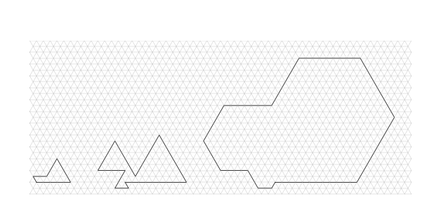
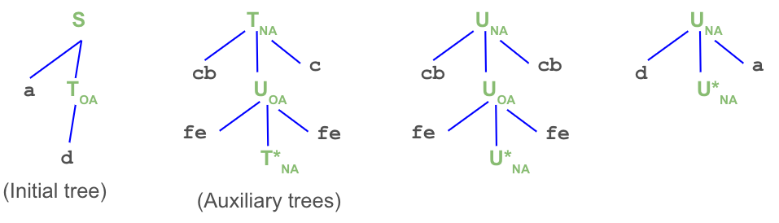

# Notes for the 'Families of Perfect Polyiamonds'

*A supplementary material for a conference article presented in University of 
Latvia on 2024-02-14.*

**Definition 1:** 
A *polyiamond* is a simple polygon made of equilateral triangles. 
A *perfect $n$-polyiamond is a polyiamond whose sides are of lengths $n,n-1,\ldots,1$. 
A *perfect acute polyiamond* has all interior angles 
$60^{\circ}$ or $300^{\circ}$, a *perfect obtuse polyiamond* has all angles 
$120^{\circ}$ or $240^{\circ}$.  
Perfect polyiamonds can be represented as strings over the alphabet 
$\Sigma = \{ \mathtt{a}, \mathtt{b}, \mathtt{c}, \mathtt{d}, \mathtt{e}, \mathtt{f} \}$ 
listing their side directions in decreasing length order. 

  

*Fig.1: Perfect polyiamonds.* 

In the above figure, all three types of polyiamonds are given: 

* A perfect polyiamond with $n=5$ and string representation $\mathtt{acedf}$
  ("a" - five units to the East, "c" - four units to the Northwest, 
  "e" - three units to the Southwest, "d" - two units to the West, "f" - one unit 
  to the Southeast).
* A perfect acute polyiamond with $n=9$ and string representation $\mathtt{aceceaeac}$,
* A perfect obtuse polyiamond with $n=12$ and string representation $\mathtt{abcdedefafab}$.

**Proposition 2:** 
There is no infinite set of perfect polyiamonds that is a regular language. 
(*Hint:* Apply Pumping lemma.)

**Proof:**   
By contradiction, let us assume that there exists an infinite regular language 
$L$ containing only perfect polyiamonds. 
According to the Pumping lemma for regular languages, 
every sufficiently long word from a regular language $L$ can be 
represented as a concatenation of three words $w = xyz$ with $|y| > 0$ such that all the 
words $w_n = xy^nz$ (for each non-negative $n$) are also in $L$. 

We now prove that some of $w_n$ do not represent perfect polyiamonds - no matter
what are the strings $x,y,z$. 
Consider two cases regarding $y$: 

**Case 1:** 
Let the sum of normalized unit vectors in $y$ to be equal to $u$ which is 
different from the zero vector. 
In this case by repeating $y$ multiple times, the curve will move in the direction 
of the vector $u$. No matter what is the finite sequence $z$, if we choose $n$ 
large enough, the polygonal chain will move so far away that the vectors from $z$ 
will not be sufficient to return back to its beginning and to close the polygonal chain. 

**Case 2:**
If $y$ has unit-vectors that add up to zero-vector, then by repeating $y$
sufficiently many times, one of the following will happen:    
(1) either the polygonal chain will intersect itself, or  
(2) the polygonal chain will create a shrinking spyral, where the 
distances between corresponding sides in subsequent iterations are 
constant - and for sufficiently many iterations of this spyral, one 
cannot get out of it using a finite number of remaining sides in the polygonal chain. 
$\blacksquare$

**Proposition 3:**  
There is an infinite set of perfect polyiamonds generated by   
(1) a context-free grammar;   
(2) a TAG grammar.

**Proof:**  
We need to provide grammars for both cases:

(1A) A context-free grammar to generate infinitely many perfect polyiamonds: 

* $S \rightarrow \mathtt{acec}P\mathtt{db}$,
* $P \rightarrow \mathtt{ecea}P\mathtt{abcb}$,
* $P \rightarrow \mathtt{eceaeafabcb}$.

(1B) A context-free grammar to generate infinitely many perfect acute polyiamonds: 

* $S \rightarrow \mathtt{acaeae}P\mathtt{eacacac}$, 
* $P \rightarrow \mathtt{aececacece}P(\mathtt{caea})^5$,
* $P \rightarrow \mathtt{cecececa}$.

(2) Here is a TAG grammar to generate another infinite family of polyiamonds: 

