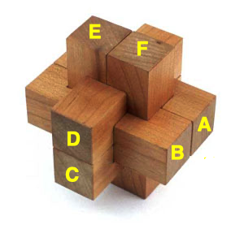

# Par krustiņiem

Šis ir nezinātnisks mēģinājums izmantot "backtracking" softu, lai saliktu rotaļlietu krustiņus. 

Katrai krustiņa detaļai iespējams ievietoties katrā no pozīcijām (A,B,C,D,E,F), 
turklāt tā var iegrozīties divos veidos. Ja, teiksim, pozīcijā A atrodas detaļa
CROSS01 (turklāt šīs detaļas labais gals sakrīt ar dzelteno burtu "A", tad 
to apzīmē `{'A': (CROSS01,0), ...}`). Savukārt, ja detaļas `CROSS01` kreisais gals
sakrīt ar dzelteno burtu "A", tad to apzīmē ar `{'A': (CROSS01,1), ...}`. 

Pavisam eksistē $6! \cdot 2^6 = 720 \cdot 64 = 46080$ veidi, kā sešās pozīcijās salikt sešas 
detaļas, starp kurām neviena nav simetriska pret apgriešanu otrādi 
un arī neviena nav vienāda ar kādu citu detaļu. 
(Visas sešu elementu permutācijas; turklāt katru detaļu var 
ievietot arī apgrieztu otrādi.)
Daudzi no tiem uzreiz jāatmet, jo detaļu kubiņi pārklājas (tādā veidā nevarētu 
detaļas salikt pat ar "teleportēšanu"). Starp tiem veidiem, kuros katrai 
detaļai pietiek vietas, ir daudz tādu, kurus faktiski nevar salikt jeb citiem 
vārdiem - ja šāds krustiņš kaut kā būtu izveidots, no tā nevarētu izvilkt pirmo detaļu. 

Programmā `burr_cross.py` krustiņu veido tādas sešas detaļas, ko var salikt ar "teleportēšanu"
$16512$ dažādos veidos tā, lai detaļas savstarpēji nepārklātos. Bet lielo 
vairumu no šiem variantiem būtu neiespējami izjaukt. Tātad arī neiespējami salikt no 
sešām atsevišķi stāvošām detaļām. 

